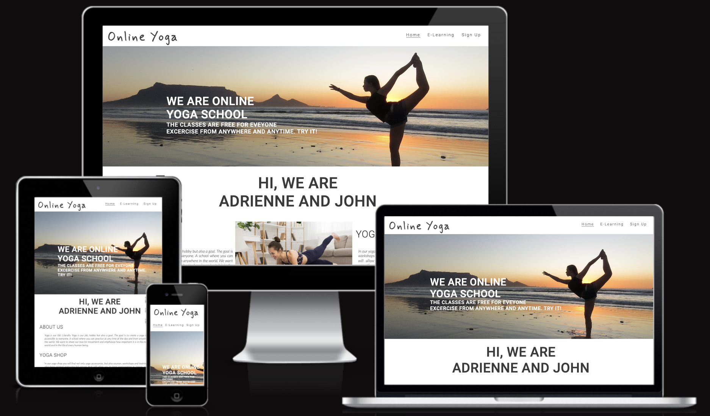
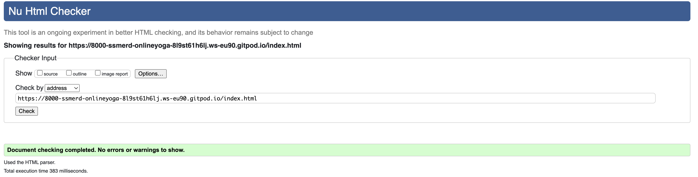
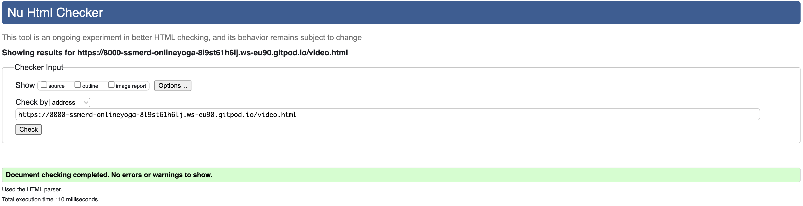

# Yoga Online 

# Introduction

A website designed to promote Yoga training online. It contains a main page with a link to E-learning website with Yoga lesson videos and a page to sign up. If I wanted to further develop the website, I would require users to sign up first in order to see videos. I embeded a sample videos from youtube.com for the project. However for the final website I would create my own videos and published them regularly.

Below are responsive images of the three pages.

Below is the online website hosted by github.com

[Project Repository](https://github.com/ssmerd/online-yoga)

To see the project code and README.md use this link

[Live Site](https://ssmerd.github.io/online-yoga/)

# Features

## Main page

* Navigation Bar

    * Featured on all pages, full responsive navigation bar includes the website logo and links to the home, e-learning videos and signup page. 
    All these features are identical on all pages to allow for easy navigation.
    * The navigation bar will allow users to esily navigate from page to page across all devices without having to revert back to the previous page via 'back' button
    * Home link allow to easily revert to the home page
    * E-learning link allow to see sample online yoga videos. Currenlty they are embeded from youtube.com.
    * To use E-learning link a user would have to sign up first. Hence there is a link to the signup page.

* The landing page

    * The landing page image includes a photograph with a text overlay to allow the user to learn what the page is about.
    * This section introduces the user to Yoga Online explaining that the yoga videos are free for everyone and can be accessed from anywhere.

* The about section

    * This section presents the goal of the website and some information about its owners.
    * Its goal is to attract users to login, watch and shop on the website

* Sign up for Newsletter section

    * The goal of this section is to allow user to sign up for the newsletter

* Footer section

    * The goal of this section is to redirect a user to social media channels related to the website.

E-Learning page

* Navigation bar as in the main page

* Sample videos

    * The complete course of yoga. I have embeded sample youtube videos.

* Sign Up page

    * This page allows users to sign up to the website in order to use videos

# UX

### Site Goals

The goal of the website is to attract users to watch yoga classes and buy some youga artefacts in the online shop (the shop doesn't exist yet).
This website is easy to navigate as well as aesthetically pleasing. Administrator should be able to easily add videos. The youga classes should be 
avaialable post signing up to the website.

### User stories

As a user:

* I want to watch yoga classes online
* I want to sign up to the site
* I want to log in to the site to watch videos

As the site administrator:

* I want to be able to add new videos
* I want to update the website as little as possible

## Wireframes

Below are wireframes create for the proect

* Main page

* Video page

* Signup page

# Testing

* ### User and responsive design testing

| Test              | Outcome |
|-------------------|---------------|
|All navigation links take user to correct page|pass|
|Footer navigation and social & social links load correct pages|pass|
|Content reformats on smaller screens|pass|
|Newsletter form submits correctly|pass|
|Newsletter form prevents wrong data types|pass|
|Signup form submits correctly|pass|

All user stories were tested and no faults were found. All links are working fine.
I used a sample youtube videos, however, in the real website I would use my own. Also to access the videos, a user would have to be signed up.
Initially I had issues with reposnsivess but I managed to find css settings to make it look well.  This allowed me to adjust certain setings so the websites 
looked good on different devices. 

I thorouglhy tested the website and its responsivness with Google Inspect functionality and ui.dev/amiresponsive tool. This proved the most troublesome in the project. As advised by me mentor I should have built the mobile version first and then add functionality for bigger screen sizes, as opposed to bulding the destop version first.

    
* ### Code and CSS validators

HTML and CSS validators were used to test the pages and css validity. No issues were found.

* Home page html validation results

* E-learning  page html validation results

* Signup page html validation results

* CSS validation results

## Deployment

The yoga online page was deployed to GitHub. Below is the link:

[Live Site](https://ssmerd.github.io/online-yoga/)

This site was deployed to GitHub pages. The steps to deploy are as follows:

*   In the GitHub reposotory, navigate to the Settings tab
*   From the source sectiondrop-down menu, select the Master Branch
*   Once the Master Branch has been selected, the page will be automatically refreshed wit hthe detail ribbon display to indicate the successful deployment

# Cloning the GitHub repo

This repo can be cloned as follows:

*   On the main repo page [Repo page] (https://github.com/ssmerd/online-yoga) navigate to the Code tab
*   Click Code buton and copy the git url or download the zip file
*   You can create your own repository to work on the project

# Working with GitPod

I used GitPod to work on the project. 

*   First I installed a GitHub GitPod extension in Chrome. This allows to create the workspace to work on the project on the repository
*   I usually starte by pressing GitPod extension as my GitPod workspaces usually time out.

[GitPod extension] (https://chrome.google.com/webstore/detail/gitpod-always-ready-to-co/dodmmooeoklaejobgleioelladacbeki)

# Citation of Sources

* ### Inspiration

The project was inspired by the code institute Love Running project.

* ### HTML and CSS 

https://www.w3schools.com/

https://stackoverflow.com/

* ### Wireframes

https://balsamiq.cloud

* ### Responsivness testing

https://ui.dev/amiresponsive

Chrome Inspect

* ### HTML and CSS validations

https://validator.w3.org/
https://jigsaw.w3.org/css-validator/

* ### Fonts and icons

Goole Fonts and Icons

https://fonts.google.com/

Font Awsome

https://fontawesome.com/

* ### Media

Photos used for the main and signup page come from:

https://www.shutterstock.com/

https://www.pexels.com/

Videos in the E-learning page come from:

https://www.youtube.com/results?search_query=yoga+with+adriene+

# Future Featuers

Access to the videos would be secured by logging to website. First a user would have to sign up. Currently I don't have skills to do that.

I'd like to develop a shop selling yoga artefacts to monitize  the website. Currently I dont have skills to do that.

Also I would add a link to a donate website.

### <a name="acknowledge">Acknowledgements</a>

* Mentor - Chris Quinn
* Cohort Facilitator - Special credit to Alan Bushell who gave great support and tips when testing the website.